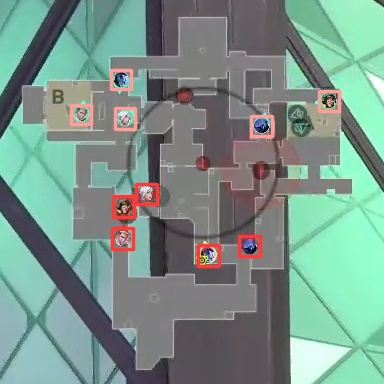
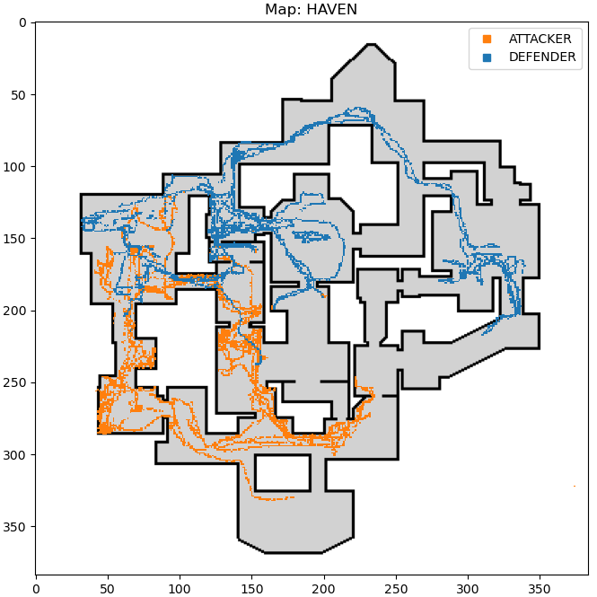

# Object detection on videos using YOLOv5

An individual project as part of the Computer Science Master's program at the University of Ulm.

## Project Description

The scope of this project was to gain experience in the usage of an existing machine learning model (YOLOv5 [1]) by using own data. The main goal was to analyze player behaviour in a video game (Valorant). Due to the reason that the only public available data is accesible via the game itself as screen capture or recorded videos, the YOLOv5 model was trained to detect player icons from a game overlay (figure 1). A more detailed description of the used data can be found in the `docs/dataset.md`. The training was performed on images, while the trained model can be applied on recorded videos. As example output for an analysis a simple heatmap was chosen, as it can be seen in figure 2. It describes the positions of the teams in one round of the game.

The first challenge was to prepare suitable data and label a sufficient amount of images. As a second challenge several training setups were tested, where network configurations for transfer learning and training from scratch were found. The dataset with most images (1000) was applied and satisfying results could be achived. Thereby the transfer learning task performed best.

Next to the machine learning framework YOLO (You Only Look Once) the labeling application "Label Studio" [2] was used in this project.

<br><br>
<span>
<figure>
    
    <figcaption><b>Figure 1:</b> Detected labels (in red: attackers, in pink: defenders).</figcaption>
</figure>
<br><br>
<figure>
    
    <figcaption><b>Figure 2:</b> Example output of a video analysis.</figcaption>
</figure>
</span>


<br><br><br>
[1] Glenn Jocher. YOLOv5 by Ultralytics. May 2020. DOI: [10.5281/zenodo.3908559](10.5281/zenodo.3908559).<br>
[2] Label Studio - Open Source Data Labeling. URL: [https://labelstud.io/](https://labelstud.io/).

## Project Structure

```
├── README.md
│
├── data
│   ├── interim        <- Intermediate data that has been transformed
│   ├── processed      <- Final datasets & data for prediction tasks
│   └── raw            <- Original, immutable data 
│
├── docs
│
│── models             <- Model data for/from training/validation/testing
│
├── notebooks          <- Jupyter notebooks 
│
├── scripts            <- Scripts 
│
└── src                <- Source code
    └── data           <- Scripts generate datasets
```

